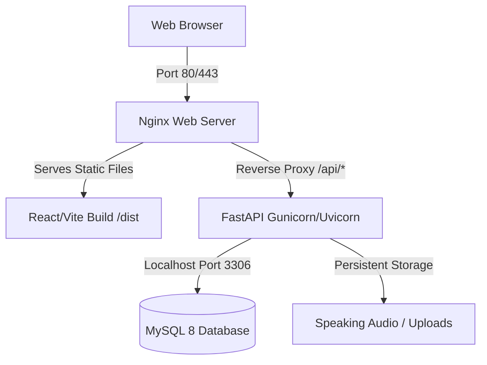

# Visa House LMS — Deployment Guide (Oracle Free VPS / Ubuntu)

This guide provides instructions to deploy the full-stack Visa House LMS on a single Virtual Private Server (like the Oracle Cloud Always Free VM running Ubuntu 22.04 LTS).

---

## Architecture Overview



---

## Step 1: Provision your Oracle Free VM
1. Go to the [Oracle Cloud Free Tier Console](https://www.oracle.com/cloud/free/) and sign up.
2. Create a Compute Instance:
   * **OS:** Ubuntu 22.04 LTS (Minimal or Standard).
   * **Shape:** Ampere (ARM64) or VM.Standard.E2.1.Micro. Select up to **2 OCPUs and 12 GB RAM** (fits within the updated Always Free tier).
   * **SSH Keys:** Save both your private and public keys.
3. Once the instance is running, copy the public IP.

---

## Step 2: Open Ports in Oracle Cloud
In the Oracle Cloud Console, you must open HTTP and HTTPS ports:
1. Go to **Networking > Virtual Cloud Networks > your-VCN > Security Lists**.
2. Click **Default Security List for your-VCN**.
3. Under **Ingress Rules**, add the following rules:
   * **Source CIDR:** `0.0.0.0/0` | **IP Protocol:** `TCP` | **Destination Port Range:** `80` (HTTP)
   * **Source CIDR:** `0.0.0.0/0` | **IP Protocol:** `TCP` | **Destination Port Range:** `443` (HTTPS)

---

## Step 3: Server Setup & Dependencies
Connect to your VM via SSH:
```bash
ssh -i /path/to/private_key.key ubuntu@YOUR_VM_IP
```

Update packages and install dependencies:
```bash
sudo apt update && sudo apt upgrade -y
sudo apt install -y git python3-pip python3-venv nginx mysql-server certbot python3-certbot-nginx nodejs npm
```

---

## Step 4: Configure the MySQL Database
1. Access MySQL:
   ```bash
   sudo mysql
   ```
2. Create the database and user:
   ```sql
   CREATE DATABASE ielts_lms CHARACTER SET utf8mb4 COLLATE utf8mb4_unicode_ci;
   CREATE USER 'ielts_user'@'localhost' IDENTIFIED BY 'SetAGoodStrongPassword123!';
   GRANT ALL PRIVILEGES ON ielts_lms.* TO 'ielts_user'@'localhost';
   FLUSH PRIVILEGES;
   EXIT;
   ```

---

## Step 5: Deploy the Code
1. Create a directory for the app and clone the repository:
   ```bash
   sudo mkdir -p /var/www/visahouse
   sudo chown -R ubuntu:ubuntu /var/www/visahouse
   cd /var/www/visahouse
   git clone <YOUR_GIT_REPOSITORY_URL> .
   ```

2. Set up the Python virtual environment and install requirements:
   ```bash
   cd backend
   python3 -m venv .venv
   source .venv/bin/activate
   pip install --upgrade pip
   pip install -r requirements.txt
   ```

3. Create the production environment variables:
   ```bash
   cp ../deploy/backend.env.production.example .env
   nano .env
   ```
   * *Ensure you change `DATABASE_URL` to point to the MySQL user/password created in Step 4.*
   * *Generate a real `SETTINGS_ENCRYPTION_KEY` using the instructions inside the template file.*

4. Run the database migrations to set up tables:
   ```bash
   alembic upgrade head
   ```

---

## Step 6: Configure the Backend Service (systemd)
Deploy the systemd configuration file to ensure the FastAPI backend stays online:
```bash
sudo cp ../deploy/visahouse-backend.service /etc/systemd/system/
sudo systemctl daemon-reload
sudo systemctl enable visahouse-backend
sudo systemctl start visahouse-backend
```

Verify it running:
```bash
sudo systemctl status visahouse-backend
```

---

## Step 7: Build & Host the Frontend
1. Navigate to the frontend directory:
   ```bash
   cd ../frontend
   ```
2. Set up your environment (if you need to customize api endpoint, though default configuration proxies requests correctly):
   ```bash
   echo "VITE_API_BASE_URL=/api" > .env.production
   ```
3. Install packages and compile static files:
   ```bash
   npm install
   npm run build
   ```
   *This outputs compile bundles to `frontend/dist/`.*

---

## Step 8: Configure Nginx & SSL
1. Copy the Nginx configuration template:
   ```bash
   sudo cp ../deploy/nginx-visahouse.conf /etc/nginx/sites-available/visahouse
   sudo ln -s /etc/nginx/sites-available/visahouse /etc/nginx/sites-enabled/
   sudo rm -f /etc/nginx/sites-enabled/default
   ```
2. Open the file and adjust your domain name:
   ```bash
   sudo nano /etc/nginx/sites-available/visahouse
   ```
3. Test Nginx and reload:
   ```bash
   sudo nginx -t
   sudo systemctl reload nginx
   ```
4. Set up Free SSL certificates with Certbot:
   ```bash
   sudo certbot --nginx -d yourdomain.com -d www.yourdomain.com
   ```
   *Certbot will automatically modify the Nginx file to enable HTTPS (port 443).*

---

## Step 9: Post-Deploy Verification
1. Access `https://yourdomain.com` in your browser.
2. Sign in or sign up.
3. Test a speaking record section to verify file uploads work and persist under `/var/www/visahouse/storage`.
